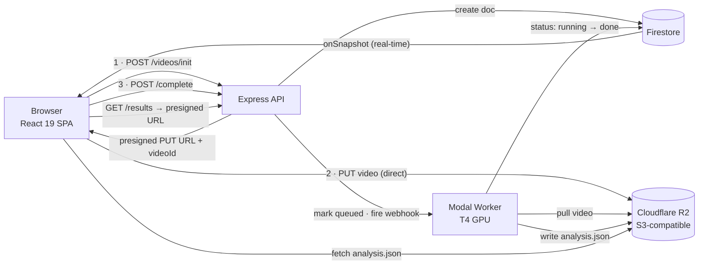

# Shuttleye

**Upload a match video. Get automated shuttle tracking, court geometry, player poses, and stroke-by-stroke shot analysis.**

A full-stack platform that turns raw badminton footage into actionable, stroke-level insight using a computer-vision + ML pipeline.


---

## Screenshots

| Dashboard | Analysis | Shot Stats |
|-----------|----------|------------|
|  |  |  |

---

## What it does

- **Shuttle tracking** — frame-by-frame shuttlecock position via a TrackNet-family detector.
- **Court geometry** — detects court keypoints and computes a pixel → real-world-meters homography for a standard 6.1 × 13.4 m court.
- **Player pose** — per-frame player bounding boxes and skeletons (YOLO pose).
- **Hit detection** — a dual-signal approach (shuttle-trajectory reversals + wrist-velocity peaks) cross-validated for robustness.
- **Shot classification** — each hit is labeled as one of six stroke types: **Clear, Smash, Drop, Drive, Net, Lob** — with learned models and heuristic fallbacks.
- **Real-time job status** — uploads move through `uploading → queued → running → done` and stream to the UI live via a Firestore listener (no polling).
- **Shot heatmap** — detected shots plotted in real court coordinates, colored by stroke type.

---

## Architecture

Three independently deployed services that communicate **only** through a Firestore document and an `analysis.json` file in object storage — never through direct calls.



| Service | Path | Role |
|---------|------|------|
| **Frontend** | `frontend/badminton-ai` | React 19 + Vite SPA. Firebase Auth, real-time dashboard, analysis visualization. |
| **Backend** | `backend` | Node/Express 5 orchestration layer: mints presigned upload/download URLs, owns the Firestore job document, triggers the worker. Never touches raw video bytes. |
| **Worker** | `worker` | Python CV/ML pipeline, deployed to [Modal](https://modal.com) as a serverless T4 GPU function. |

> See [`data-flow.md`](data-flow.md) for the full upload → processing → results flow, the Firestore schema, and the `analysis.json` payload shape.

---

## How it works (the pipeline)

The worker's `process_video()` runs a two-pass pipeline:

1. **Homography setup** — scans the opening frames for 6 court keypoints, then computes the pixel → meters perspective transform. All real-world `location_m` values flow from this.
2. **Pass 1 · Shuttle tracking** — a TrackNet-family model produces a per-frame heatmap; the argmax gives the shuttle `(x, y)`, filtered by confidence and court bounds.
3. **Pass 2 · Pose inference** — YOLO pose extracts player boxes + skeletons, filtered to players inside the court.
4. **Hit detection** — a *trajectory* signal (gap/reversal detection) and a *pose* signal (wrist-velocity peaks near the shuttle) are computed independently.
5. **Hit merging** — the two signals are cross-validated; hits both agree on are marked `confirmed`.
6. **Shot classification** — a skeleton-sequence window around each hit is classified into a stroke type, with a rule-based fallback on trajectory shape when a learned model isn't available.

Every optional model path degrades gracefully to the next fallback rather than erroring.

---

## Tech stack

- **Frontend:** React 19, TypeScript, Vite, Tailwind CSS v4, Radix UI, React Router 7, Firebase (Auth + Firestore)
- **Backend:** Node.js, Express 5, Firebase Admin, `@aws-sdk/client-s3` (presigned URLs), Pino, `express-rate-limit`
- **Worker:** Python, PyTorch / ONNX Runtime, OpenCV, deployed on Modal (NVIDIA T4)
- **Storage:** Cloudflare R2 (S3-compatible object storage)
- **Infra:** Docker, Docker Compose (frontend + backend); Modal (worker)

---

## Getting started

### Prerequisites

- Node.js 20+
- Docker Desktop (for the quick start)
- Python 3.10+ and a [Modal](https://modal.com) account (only if running the worker)
- A Firebase project (Auth + Firestore) and a Cloudflare R2 bucket

### Quick start (frontend + backend via Docker)

```bash
git clone https://github.com/jameshualiu/shuttleye.git
cd shuttleye

# create the env files (see below), then:
docker compose up --build
```

- Frontend → http://localhost:5173
- Backend API → http://localhost:3000

> The **worker is not part of Docker Compose** — it needs a GPU and the Modal model volume, so it only runs on Modal.

### Environment variables

**Backend** — copy the example and fill it in:

```bash
cp backend/.env.example backend/.env
```

Includes Firebase Admin credentials, S3/E2 storage keys, `MODAL_WEBHOOK_URL`, and an optional `REDIS_URL` (shared rate-limit store for serverless; falls back to in-memory when unset).

**Frontend** — create `frontend/badminton-ai/.env.local`:

```bash
VITE_FIREBASE_API_KEY=
VITE_FIREBASE_AUTH_DOMAIN=
VITE_FIREBASE_PROJECT_ID=
VITE_FIREBASE_STORAGE_BUCKET=
VITE_FIREBASE_MESSAGING_SENDER_ID=
VITE_FIREBASE_APP_ID=
```

### Running each service directly

```bash
# Frontend (Vite dev server on :5173)
cd frontend/badminton-ai
npm install
npm run dev

# Backend (nodemon on :3000)
cd backend
npm install
npm run dev
npm test          # jest unit tests

# Worker (Python ML pipeline)
cd worker
pip install -r requirements.txt
pytest                       # run the test suite
modal run app.py             # run once on Modal
modal deploy app.py          # deploy the endpoint
```

---

## Acknowledgements

- **ShuttleSet** (Wang et al., KDD 2023) — labeled badminton stroke dataset used for stroke classification.
- **VIRD** (Lin et al., IEEE TVCG 2024) — research that shaped the focus on actionable, stroke-level feedback over raw video.

---

## License

Released under the MIT License. See [LICENSE](LICENSE).
